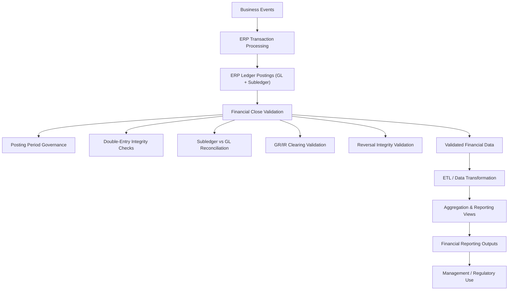

# Financial Close Validation Engine

## Overview

This project simulates the financial validation and reporting-readiness layer of an enterprise finance system using SQL.

It models how posted accounting data is validated for structural integrity, reconciliation accuracy, and period governance during financial close. It then extends into a simplified reporting layer, where validated finance data is transformed and aggregated into reporting outputs.

The solution applies control checks across ledger postings, subledgers, and clearing accounts, and demonstrates how finance data moves from validated accounting records into reporting views.

Together with the ERP Ledger Posting Simulation repository, this project forms part of a broader transaction-to-report finance systems portfolio.

---

## Business Context

In regulated environments (banking, capital markets, large corporates), financial close requires systematic validation before:

- Regulatory reporting
- Financial statement submission
- Consolidation
- Management reporting

Errors typically arise from:

- Postings in closed periods
- Unbalanced documents
- Missing reversals
- Subledger mismatches
- Clearing account residuals

This project models those control mechanisms in a simplified architecture.

---

## Architecture

The solution contains:

- `schema.sql` – data model for ledger, AR/AP open items, and posting period control
- `sample_data.sql` – close scenario sample transactions
- `controls.sql` – detailed validation control queries
- `control_summary.sql` – aggregated close health overview (dashboard-ready)
- `reporting_layer.sql` – reporting aggregation views built on validated finance data

---

## Reporting & Data Flow Layer

This project also simulates the downstream reporting layer that follows financial close validation.

Once accounting data has passed close controls, it moves through a simplified reporting pipeline:

**1. Extraction**  
Validated ledger and subledger data is selected from ERP-style source tables.

**2. Transformation**  
Data is standardized for reporting purposes, including sign handling, reporting periods, and reporting dimensions such as company code, vendor, and customer.

**3. Aggregation**  
Transaction-level data is rolled up into reporting-oriented summaries such as:

- monthly revenue
- AR open balances
- AP open balances
- GR/IR balances
- simple P&L views

**4. Reporting output**  
These aggregated views represent the final consumption layer used by finance teams for management reporting, close analysis, and working capital monitoring.

This completes the lifecycle represented across the portfolio:

**Business Event → ERP Posting → Financial Validation → Reporting Output**

---

## Financial Close Control Architecture

Financial close controls are structured across three layers:

1. Structural integrity (double-entry, reversals)
2. Reconciliation integrity (AR/AP vs GL, GR/IR)
3. Period governance (posting period enforcement)

This mirrors real-world close governance frameworks.

---

## Financial Close & Reporting Architecture Diagram

---

## Example Usage (PostgreSQL)

1. Run `schema.sql`
2. Run `sample_data.sql`
3. Run `controls.sql`
4. Run `control_summary.sql`
5. Run `reporting_layer.sql`

The summary and reporting queries provide a high-level close health and reporting-readiness view.

---

## Purpose

This repository serves as a portfolio artifact demonstrating:

- Financial systems architecture understanding
- Control-driven thinking
- SQL-based financial validation logic
- Close governance modeling

Together with the ERP Ledger Posting Simulation repository, this project represents the validation and reporting layer of a complete transaction-to-report finance systems lifecycle.
